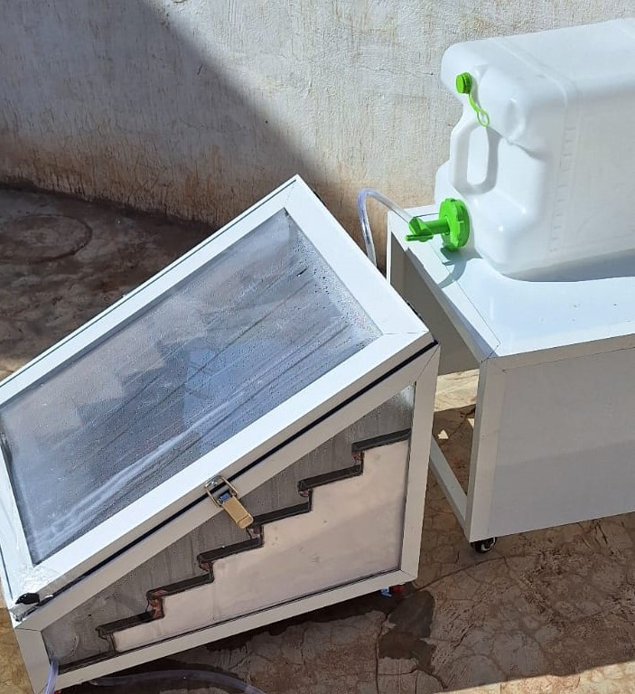
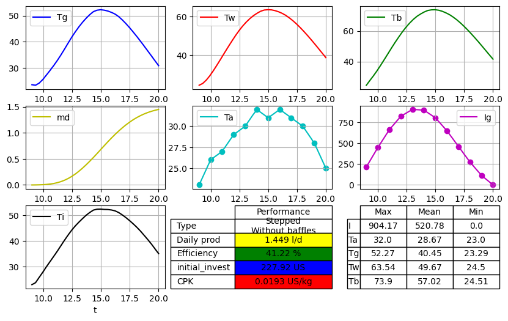

# SolarStill

An open-source Python tool that predicts the performance and the water cost of a solar still before it is built.

You describe the still in one Excel file (geometry, materials, local weather). The tool returns the temperatures of the cover, water and basin, the daily yield, the thermal efficiency and the cost per kg of distilled water, and it draws the design.



## What it does

- Simulates four geometries: **conventional**, **inclined**, **cascade** and **stepped** solar stills, with or without baffles.
- Solves the transient energy balance of the cover, the saline water and the basin (lumped-capacitance model).
- Recalculates the properties of saline water, distilled water and humid air at every time step with the IAPWS formulations.
- Models the feed of salt water through the supply valve (Torricelli) and the head losses of the still.
- Estimates the cost per kg of water, component by component, with two sets of assumptions.
- Compares the simulation with your measurements when they are available.
- Feeds a shared dataset used to train a machine-learning model (Random Forest) that predicts yield, efficiency and cost.



## Demo

- [Demonstration of the tool (video)](Readme/SolarStill_Demo.mp4): filling the Excel file and running the simulation.
- [Stepped solar still prototype in operation (video)](Readme/stepped_SS.mp4)

## Quick start

### On your computer

```bash
git clone https://github.com/FatiP2N/SolarStill.git
cd SolarStill
pip install -r requirements.txt
python solarstill.py
```

### In Google Colab or Jupyter

Upload `solarstill.py` and one of the Excel files, then run:

```python
!pip install iapws
from solarstill import SolarStill, Error_deviation

ss = SolarStill("conventional.xlsx", 24)   # Excel file, number of time steps per measurement interval
ss.plot_device()          # technical sheet, price and drawing of the still
ss.ss_performances()      # simulation
ss.plot_performances()    # temperatures, daily yield, efficiency, cost
Error_deviation().error_calculation(ss)   # comparison with the measurements of the Exp_Data sheet
```

## The Excel input file

Each example file (`conventional.xlsx`, `cssb.xlsx`, `stepped.xlsx`) has five sheets:

| Sheet | Content |
|---|---|
| `Meteo` | Time, ambient temperature, solar irradiation, pressure, wind speed, humidity, site and month |
| `design` | Dimensions of the still, tilt angles, number of steps, baffles, type of still |
| `material` | Optical and thermal properties, prices and lifetimes of the cover, basin and insulation; salinity and mass of water |
| `Corr` | Choice of the evaporation model (Dunkle, Hollands, Chen, Zheng) |
| `Exp_Data` | Measured temperatures and distilled water, if available |

Two optional sheets, each with two columns (`Parameter`, `Value`), override the defaults:

- `Cost`: `interest`, `sunny_days`, `labor_step`, `labor_length`, `support_low`, `support_high`.
- `Options`: `feed` (feed flow in kg/h), `kv`, `ks` (head-loss coefficients) and `solver` (`rk4` or `stiff`).

## Useful options

```python
ss.feed = 1.8            # measured feed flow in kg/h (replaces the hydraulic calculation)
ss.kv = ss.kv_for_flow(1.8)   # or: valve head-loss coefficient that gives this flow
ss.solver = "stiff"      # implicit solver, needed for thin films and light basins (inclined stills)
ss.interest = 0.12       # annual interest rate used for the cost
```

## Outputs

| Output | Attribute | Unit |
|---|---|---|
| Daily yield | `ss.me` | kg/day |
| Yield per m² of basin | `ss.yield_m2` | kg/m²/day |
| Efficiency, absorbed energy | `ss.efficiency` | % |
| Efficiency, incident solar energy | `ss.efficiency_incident` | % |
| Initial investment | `ss.usprice` | USD |
| Cost per kg, your assumptions | `ss.cost` | USD/kg |
| Cost per kg, 12 % interest over 10 years | `ss.cost_standard` | USD/kg |

The error report gives the mean-bias error (difference of the daily means), and the point-by-point errors (RMSE in °C and mean absolute error in %) for the cover, water and basin, plus the deviation on the daily yield.

## Validation status

The model was validated against experiments on four geometries (conventional, inclined, cascade and stepped); the method and the results are published in the Desalination 595 (2025) article cited below.

The code in this repository is being updated (feed-flow model, cost module, solver). The validation cases are being re-run with this version, and the results will be added here.

Known limitations: the model does not represent the loss of light through the condensate on the cover, the variation of transmission with the angle of the sun, or the droplets falling back into the basin. Results depend on the quality of the weather data and of the material properties entered.

## Roadmap

Planned developments:

- **Weather database**: retrieve irradiation, temperature and wind automatically from the coordinates of the site (for example PVGIS or NASA POWER) instead of entering them by hand.
- **Materials database**: a shared library of optical, thermal and cost properties of cover, absorber and insulation materials.
- **New geometries and designs**: double-slope, pyramid, hemispherical, spherical, tubular and hyperbolic solar stills.
- **More thermal models**: additional correlations for evaporation and condensation.
- **Larger open dataset**: more experimental cases from other laboratories, to improve the machine-learning model.
- **Simple interface**: a web application so that the tool can be used without Jupyter or Colab.

## Other files

| File | Content |
|---|---|
| `ml_solarstill_final.py` | Machine-learning pipeline (linear, Ridge, SVR, Random Forest) trained on `stored.xlsx` |
| `mlp_bayesien_opt.py` | Neural network (MLP) with Bayesian optimisation |
| `radiation.py` | Hourly solar irradiation estimated from monthly DNI and GHI |
| `stored.xlsx` | Dataset of simulated and experimental results |
| `Readme/` | Detailed documentation of the model (PDF), figures and demo videos |

## How to cite

If you use this tool, please cite:

- F. Belmehdi, S. Otmani, M. Taha Janan, *Enhanced mathematical modeling for optimizing solar stills with AI exploitation*, Desalination 595 (2025). https://doi.org/10.1016/j.desal.2024.118303
- F. Belmehdi, S. Otmani, M. Taha Janan, *Global trends of solar desalination research: A bibliometric analysis during 2010–2021 and focus on Morocco*, Desalination 555 (2023).

## Contributing

You can help improve the tool by testing it on your own solar still and sharing your results: open an issue with your Excel file, or add your measurements to the shared dataset. Every new case improves the machine-learning model.

## Author

Fatima Belmehdi, PhD in Energy Engineering (Mohammed V University of Rabat). ORCID: [0000-0001-5194-8940](https://orcid.org/0000-0001-5194-8940)
